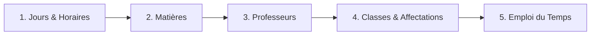

# 📘 GUIDE MAÎTRE ET ARCHITECTURE GLOBALE : SAAS DIONGUE-IZISCHOOL

> **Document de Référence & Mémoire Projet**  
> Ce document synthétise l'architecture intégrale, le design system, les algorithmes de résolution sous contraintes, le modèle SaaS multi-tenant, les fonctionnalités clés et les points forts du logiciel.

---

## 🧭 1. VUE D'ENSEMBLE DU PROJET

**Diongue-IziSchool** est un SaaS B2B moderne conçu pour automatiser et optimiser la création, la gestion et l'exportation des emplois du temps scolaires (collèges, lycées, universités, instituts de formation).

### 🎯 Objectifs Principaux
1. **Élimination totale des conflits d'horaires** (superposition de profs, de classes, ou de salles).
2. **Respect des règles pédagogiques avancées** (découpage en blocs de 2h max, espacement des cours sur la semaine, variation des heures de début).
3. **Ergonomie & Expérience Utilisateur** de niveau supérieur (Design Dark/Light Mode immersif, Drag & Drop interactif, barre de progression 5 étapes).
4. **Plateforme SaaS prête à la commercialisation** (Souscription par paliers de prix en FCFA/Mois, gestion de clés de licence, portail d'administration dédié).

---

## 🎨 2. DESIGN SYSTEM & ERGONOMIE

### Palette de Couleurs & Thème
- **Thème Sombre (Dark Mode)** : Fond `slate-950` / `slate-900`, cartes en verre dépoli (`backdrop-blur-xl`, `bg-slate-900/60`), bordures fines luminescentes `border-white/10`.
- **Thème Clair (Light Mode)** : Fond `slate-50`, cartes épurées en blanc pur, contrastes typographiques renforcés (`slate-900`, `indigo-700`).
- **Couleurs d'Accompagnement** :
  - **Indigo / Violet** (`#4f46e5`, `#6366f1`) : Identité principale, actions prioritaires.
  - **Émeraude (Emerald)** (`#10b981`) : Succès, score 100%, quotas respectés.
  - **Ambre / Rouge** (`#f59e0b`, `#ef4444`) : Alertes, indisponibilités, dépassements de charge.

### Typographie & Composants
- **Polices** : Sans-serif moderne (Inter / Segoe UI) + Monospace (JetBrains Mono / Fira Code) pour les heures, quotas et identifiants.
- **Micro-animations** : Transitions fluides sur le drag-and-drop, badges animés pour les statuts et alertes.

---

## 🔄 3. LE WORKFLOW GUIDÉ EN 5 ÉTAPES

Le parcours utilisateur est structuré en 5 étapes séquentielles accessibles via la barre de progression supérieure et la barre latérale :



### 🔹 Étape 1 : Configuration des Jours & Plages Horaires
- **Choix des jours ouvrés** : Sélection interactive du Lundi au Samedi avec présélections rapides (*Lundi-Vendredi 5j* ou *Lundi-Samedi 6j*).
- **Amplitude quotidienne personnalisée** : Définition de l'heure de début (ex: `08h00`) et de l'heure de fin (ex: `18h00` ou `22h00`).
- **Calcul automatique de capacité** : Synthèse du volume de créneaux disponibles par classe et par semaine.
- **Répercussion dynamique** sur toutes les grilles, formulaires d'indisponibilités et exports.

### 🔹 Étape 2 : Référentiel des Matières
- Création, édition et suppression des matières scolaires.
- Attribution de pastilles de couleurs personnalisées pour une identification visuelle instantanée.

### 🔹 Étape 3 : Gestion des Enseignants
- Déclaration des professeurs, affectation de leurs matières de spécialité.
- Définition du **Quota Hebdomadaire Visé** (en heures).
- **Grille interactive d'indisponibilité** : Marquage en un clic des temps libres ou créneaux réservés.

### 🔹 Étape 4 : Classes & Affectations Pédagogiques
- Déclaration des classes / niveaux (6ème A, Terminale S1, etc.).
- **Affectation des cours via menu déroulant** : Liaison `(Matière, Professeur, Volume Horaire Hebdomadaire)`.
- **Grille de fermeture de classe** : Marquage des heures où la classe n'est pas disponible (ateliers, fermetures).

### 🔹 Étape 5 : Emploi du Temps (Visualisation & Optimisation)
- **Résolution automatique** sous contraintes en un clic.
- **Vues Multiples** :
  - *Vue par Classe* : Planning hebdomadaire avec affichage des matières, professeurs, salles et durées fusionnées (`rowSpan`).
  - *Vue par Enseignant* : Planning global de l'équipe pédagogique ou focus individuel par professeur.
- **Drag & Drop interactif** : Déplacement de cours à la souris avec validation anti-conflit en direct.
- **Panier de cours non planifiés** : Permet de glisser manuellement les reliquats d'heures.
- **Indicateur de score** : Pourcentage de conformité mathématique (0 à 100%).

---

## ⚙️ 4. MOTEUR ALGORITHMIQUE & RÈGLES DE RÉSOLUTION

Le moteur de résolution ([`lib/solver.ts`](file:///c:/Users/HP/Desktop/SAAS%20EMPLOIS%20TEMPS/lib/solver.ts)) repose sur un algorithme de **Backtracking avec heuristiques avancées** :

### 1. Découpage Strict des Séances
- **Règle** : Les séances sont découpées en blocs de **2 heures maximum**, le résidu en bloc de **1 heure** (ex: 5h/semaine = `2h + 2h + 1h`, 4h = `2h + 2h`, 3h = `2h + 1h`).
- **Objectif** : Respect du rythme d'apprentissage des élèves sans saturation.

### 2. Unicité Journalière par Matière
- Une matière ne peut **jamais** apparaître plus d'une fois par jour dans une même classe (interdiction d'avoir 2h le matin et 2h l'après-midi pour la même matière, ou 2h + 2h collées pour faire 4h).

### 3. Espacement Optimal des Jours (Heuristique)
- L'algorithme privilégie un espacement maximal entre les séances d'une même matière (ex: `Lundi → Mercredi → Vendredi`).

### 4. Variation des Heures de Début
- L'algorithme évite que les cours d'une même matière débutent systématiquement à la même heure chaque jour. Il diversifie les créneaux (ex: Lundi 8h, Mercredi 10h, Vendredi 14h).

### 5. Enchaînement Compact des Matières
- Pour les créneaux d'1 heure de matières différentes, l'algorithme privilégie les blocs contigus afin d'éviter les heures de trou intempestives pour les élèves.

### 6. Détection et Blocage des Conflits
- **Zéro superposition enseignant** : Un prof ne peut être dans 2 classes en même temps.
- **Zéro superposition classe** : Une classe ne peut recevoir 2 cours simultanément.
- **Validation du Drag & Drop en temps réel** : Blocage immédiat avec explication claire en cas de tentative de collision.

---

## 📤 5. EXPORTATIONS MULTI-FORMATS

Toutes les grilles peuvent être exportées fidèlement aux formats officiels :
1. **PDF Officiel Haute Définition (`jspdf`)** :
   - En-tête personnalisé avec nom de l'établissement, slogan et logo.
   - Grille vectorielle en mode paysage A4 avec mise en évidence des matières, profs et signatures officielles.
   - Export individuel par classe, individuel par prof, ou recueil complet de tous les profs en un seul document.
2. **Microsoft Word (`.doc`)** :
   - Fichier Word structuré avec styles CSS intégrés, logo d'école et tableau éditable.
3. **Microsoft Excel (`.xlsx`)** :
   - Génération multi-onglets (un onglet par classe + onglet récapitulatif des charges et quotas enseignants).

---

## 💼 6. MODÈLE SAAS B2B & ADMINISTRATION MULTI-TENANT

Le SaaS intègre une architecture commerciale complète ([`components/SaaSAdminPortal.tsx`](file:///c:/Users/HP/Desktop/SAAS%20EMPLOIS%20TEMPS/components/SaaSAdminPortal.tsx)) :

### 💎 Grille Tarifaire (FCFA / Mois)
1. **Starter (Gratuit - 0 FCFA)** : Jusqu'à 3 classes, 5 professeurs, exports PDF/Excel basiques.
2. **Établissement Standard (10 000 FCFA / mois)** : Jusqu'à 15 classes, 30 professeurs, exports PDF, Excel, Word, logo personnalisé.
3. **Pro Élite Académie (15 000 FCFA / mois)** : Classes et profs illimités, IA Gemini, exports Word personnalisés, support prioritaire.
4. **Sur Mesure Réseau Scolaire (Sur Devis)** : Multi-sites, accompagnement dédié.

### 👑 Portail Administrateur SaaS
- **Tableau de Bord Financier (KPIs)** : Revenu Mensuel Récurrent (MRR), total encaissé, taux de conversion, volume de clients actifs.
- **Gestion des Écoles Clientes** : Vue détaillée de chaque client, offre souscrite, consommation des quotas, activation/suspension.
- **Générateur de Clés de Licence** : Création de clés sécurisées (ex: `PRO-2026-XXXX`) avec durée de validité et attribution automatique.
- **Historique des Transactions** : Suivi des paiements (Wave, Orange Money, Carte Bancaire, Virement).
- **Accès Sécurisé par Code PIN** : Protection de l'espace administration.

---

## 🧠 7. CONSEILS & AUDIT IA GEMINI

L'application intègre des endpoints d'intelligence artificielle connectés à l'API Gemini :
- **Audit de charge et équilibre** : Analyse de la répartition des heures, des amplitudes des enseignants et des jours de repos.
- **Recommandations pédagogiques** : Détection des matières lourdes placées en fin de journée et propositions de rééquilibrage.

---

## 🏆 8. POINTS FORTS & AVANTAGES CONCURRENTIELS

1. **Performance & Vitesse** : Résolution complète d'un établissement en moins d'une seconde grâce à l'algorithme optimisé.
2. **Zéro Conflit Garanti** : Validation mathématique stricte tant en automatique qu'en manuel.
3. **Autonomie Utilisateur** : Interface ultra-intuitive ne nécessitant aucune formation préalable.
4. **Exports Directs Prêts à l'Impression** : Documents conformes aux exigences administratives scolaires.
5. **Résilience & Hors-ligne** : Sauvegarde continue dans le `localStorage` avec options d'import/export JSON pour sauvegarder et restaurer l'état complet.

---

## 📁 9. STRUCTURE DES FICHIERS CLÉS

```text
├── app/
│   ├── page.tsx                           # Composant principal (UI, Grilles, Workflow 5 étapes, D&D)
│   ├── globals.css                        # Design system, tokens de couleur, styles d'impression
│   ├── layout.tsx                         # Layout racine Next.js
│   └── api/
│       └── timetable/
│           ├── generate/route.ts          # Endpoint API de génération du solver
│           ├── ai-suggest/route.ts        # Endpoint d'assistance IA Gemini
│           ├── ai-analyze-problem/route.ts# Analyse des blocages
│           └── ai-execute/route.ts        # Exécution de corrections suggérées
├── lib/
│   ├── solver.ts                          # Moteur de backtracking, heuristiques et validation
│   ├── exportUtils.ts                     # Fonctions d'exportation PDF, Excel, Word
│   ├── types.ts                           # Types TypeScript (Subject, Teacher, ClassGroup, TimetableEntry, SaaS)
│   ├── demoData.ts                        # Données pédagogiques de démonstration
│   └── saasDemoData.ts                    # Données SaaS (Plans, Clients, Licences, Transactions)
├── components/
│   ├── LandingPage.tsx                    # Page d'accueil marketing et vitrine de conversion
│   └── SaaSAdminPortal.tsx                # Espace d'administration multi-tenant et gestion des abonnements
└── scripts/
    ├── test_solver_rules.ts               # Tests automatisés des règles de découpage et espacement
    └── verify_all_conflicts.ts            # Tests automatisés d'anti-collision et validation D&D
```
